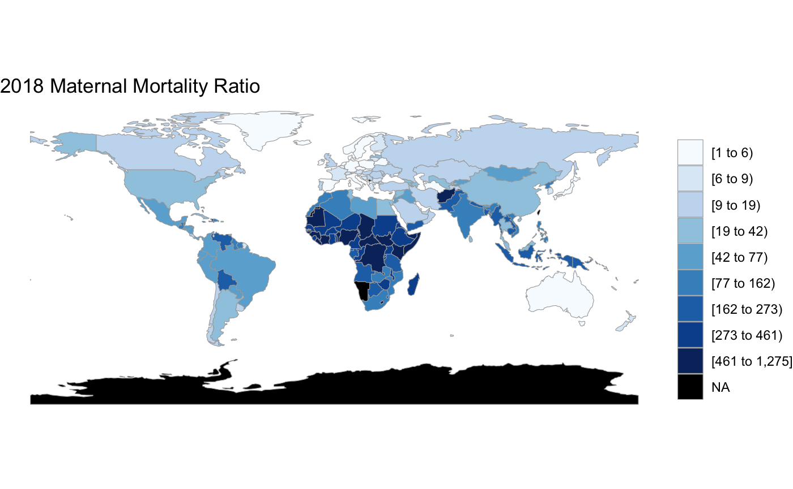

# MMR-country-level-factors
A study of the relationship between health expenditure and maternal mortality ratio (MMR) for international 2018 World Bank data. Employing various regression models that consider both private and government health expenditure, as well as their interactions with regional factors and GDP, this study uncovers noteworthy patterns. Overall, an increase in health expenditure per capita is associated with a decrease in MMR, with government health expenditure offering a greater decline compared to private expenditure. However, this association changes when analyzing health expenditure in relation to GDP – increasing GDP and private health expenditure is correlated with elevated MMR. Furthermore, region can impact how MMR varies with a change in private health expenditure. Further research should be conducted at the intersection of health expenditure and MMR to understand the underlying influences and causality of this relationship.

## Prerequisites and libraries
- R
- tidyverse
- visdat
- missForest
- corrplot
- mice
- car
- MVA
- pysch
- naniar

## Folders and Files
- Data: Contains all the csv files used to load and store data.
1. Data.csv - main data file containing 218 country observations for the year 2018 and 14 explanatory variable columns.
2. Mmr_time.csv, govt_exp_time.csv, and prviate_exp_time.csv are all subsets of the data used to create visualizations.

- Images: Contains various visualizations relating to data exploration and model validation.

- Stats_mmr_rnotebook.Rmd - main R notebook file to be used to run the entire project.

